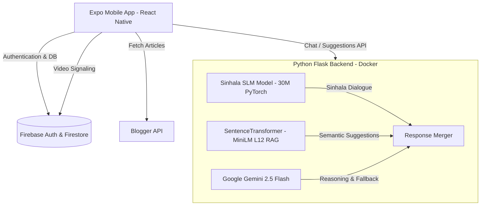

# MindCare.lk 🧠💬

MindCare.lk is a premium, empathetic mobile application and AI-driven mental health platform tailored for Sri Lanka. It provides real-time mental health evaluations, localized counseling suggestions, and WebRTC video consultations with certified psychological counselors.

---

## 🏗️ System Architecture

MindCare.lk uses a hybrid on-device/cloud architecture to support responsive, private, and intelligent mental health services:



---

## ✨ Core Features

*   **Empathetic Sinhala Chatbot:** Powered by a customized 30M parameter local Small Language Model (SLM) trained for Sinhala counseling dialogues, paired with RAG context for maximum relevance.
*   **Questionnaire & Dynamic Recommendations:** Evaluates user state severity, pulls tailored recommendations from a clinical database, and automatically applies hotline warnings (like **1926 National Mental Health Helpline**) for critical states.
*   **WebRTC Video Consultations:** Facilitates peer-to-peer video sessions directly in the app. Signaling, offer/answer negotiations, and ICE candidate exchanges are handled securely via Firestore.
*   **Counselor Scheduling & Booking:** Allows members to search for verified counselors, schedule sessions, read reviews, and cancel/reschedule appointments.
*   **Admin Panel:** Gives administrators the ability to verify newly registered counselors, edit health articles, and manage appointments.

---

## 📂 Project Structure

```
├── android/                  # Native Android project configuration
├── app/                      # File-based routes (Expo Router)
│   ├── (tabs)/               # Main user tab screens (Chat, Counselors, Articles)
│   ├── (counselor-tabs)/     # Specific views for registered counselors
│   ├── (admin-tabs)/         # Administration controls
│   └── _layout.tsx           # Navigation container & Auth wrapper
├── backend/                  # Python Flask API & AI model files
│   ├── app.py                # Flask main routes & controller
│   ├── inference.py          # PyTorch SLM loading & tokenization
│   ├── Dockerfile            # Container config (ports exposed to 7860)
│   └── requirements.txt      # Python backend packages
├── components/               # Custom UI views, overlays, & state managers
├── context/                  # Global Context providers (AuthContext)
├── lib/                      # Helper modules (Firebase client configs, DB CRUD helpers)
└── services/                 # External service bindings (Blogger, Chatbot API, WebRTC)
```

---

## 🚀 Local Development

### Prerequisites
*   **Node.js:** v18 or later
*   **Python:** v3.10 or later
*   **Java JDK & Android Studio/SDK:** (Only needed for local Android APK builds)

### Frontend Configuration
1. Clone the repository and install packages:
   ```bash
   npm install
   ```
2. Configure local environment variables in `.env.local`:
   ```env
   EXPO_PUBLIC_FIREBASE_API_KEY=your_key
   EXPO_PUBLIC_FIREBASE_AUTH_DOMAIN=your_auth_domain
   EXPO_PUBLIC_FIREBASE_PROJECT_ID=your_project_id
   EXPO_PUBLIC_FIREBASE_STORAGE_BUCKET=your_bucket
   EXPO_PUBLIC_FIREBASE_MESSAGING_SENDER_ID=your_sender_id
   EXPO_PUBLIC_FIREBASE_APP_ID=your_app_id
   ```
3. Start the Metro Bundler:
   ```bash
   npx expo start
   ```

### Backend Configuration
1. Navigate to the backend directory and set up a virtual environment:
   ```bash
   cd backend
   python3 -m venv .venv
   source .venv/bin/activate
   pip install -r requirements.txt
   ```
2. Configure environment variables in `.env`:
   ```env
   GEMINI_API_KEY=your_gemini_api_key
   ```
3. Run the Flask server:
   ```bash
   python app.py
   ```

---

## ☁️ Production Deployment (Hugging Face Spaces)

The backend is containerized via Docker and deployed to **Hugging Face Spaces** using the Docker SDK to handle the high-memory footprint of PyTorch:
*   **Runtime Environment:** Docker Container (configured to expose port `7860`).
*   **Hardware Specification:** CPU Basic (16GB RAM, 50GB storage) to prevent Out-of-Memory (OOM) crashes during model load.
*   **Model Storage:** Large PyTorch weights (`best_model_params_sinhala.pt`) are tracked and uploaded using **Git LFS** (Large File Storage).
*   **Secrets Management:** The `GEMINI_API_KEY` is loaded from the space's environment variables (configured via Settings > Variables and Secrets).

---

## 📱 Releasing the Android App (APK)

Since native modules are integrated, build the standalone APK locally using Gradle:

```bash
cd android
./gradlew assembleRelease
```

Once the compilation completes, the output file will be saved at:
`android/app/build/outputs/apk/release/app-release.apk`

The compiled APK is ready for manual distribution, internal testing, or uploading to GitHub Releases.
